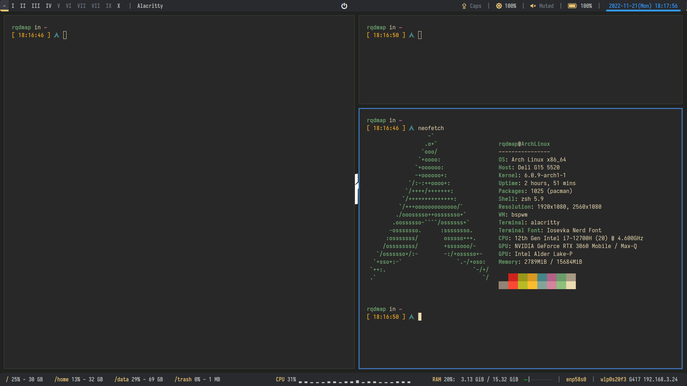

# dotfiles
Those make my Linux unique.

## Overview

## Include

- Editor: vim, neovim

- Terminal emulator: Alacrityy

- Shell: zsh

- ZSH theme: Starship

- WM: bspwm

- Hotkey: sxhkd

- Status bar: polybar

- Launcher: rofi (Not cleaned yet; many other themes existing)

- Filemanager: ranger

- Proxy: clash

