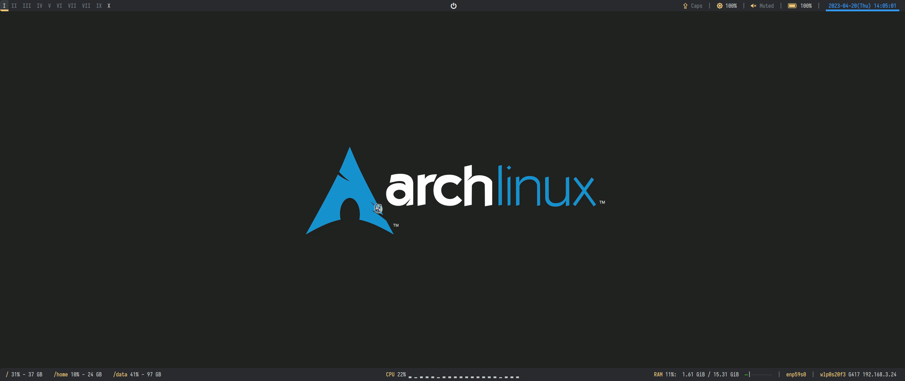

# dotfiles

Those make my Linux unique.

## Overview

## Software

- Editor: Neovim

- Terminal emulator:
	- Alacritty(Main)
	-	URxvt

- Shell: zsh

- zsh theme: Starship

- WM: bspwm

- Hotkey: sxhkd

- Status bar: polybar

- Launcher: rofi

- Compositor: picom

- Display manager: lightdm(theme: [rqdmap/lightdm-webkit-theme-litarvan](https://github.com/rqdmap/lightdm-webkit-theme-litarvan))
	- SDDM will hangs during logout with xf86-video-nouveau driver. 
	- Console dm(such as ly Etc.) doesn't support X script.

- Proxy: clash

- Grub Theme: 
	- [xenlism/Grub-themes: Grub Themes](https://github.com/xenlism/Grub-themes)
	- [AdisonCavani/distro-grub-themes: A pack of GRUB2 themes for each Linux distribution](https://github.com/AdisonCavani/distro-grub-themes)

- FileManager: ranger

- PDF Reader/Editor
	- Zathura
	- PDF Arranger

- Video recorder:
	- giph 
	- OBS

- Screenkey

- Notification Servers: dunst

- Lock: xss-lock

- Cursor hide: unclutter

## System Config

- iptables

- X11

- plymouth

## Todo

- [ ] Trace system config files, such as `/etc/systemd/logind.conf` and so on.

- [ ] One-Click Deploy & Backup

- [ ] Add personal shell script

- [ ] Treat neovim config(or something much more complex than single config file) to a submodule

- [ ] Add some images or videos to display desktop environment

