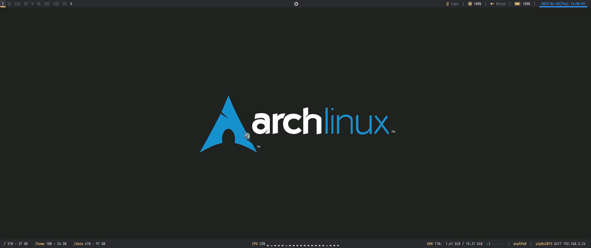

# dotfiles with GNU/Stow

使用 GNU/Stow 管理的个人 Liunx 配置文件.



## 软件清单

- Editor: Neovim

- Terminal emulator:

	- Alacritty(Main)

	-	URxvt

- Shell: zsh

- zsh theme: Starship

- WM: bspwm

- Hotkey: sxhkd

- Status bar: polybar

- Launcher: rofi

- Compositor: picom

- Display manager: lightdm(theme: [rqdmap/lightdm-webkit-theme-litarvan](https://github.com/rqdmap/lightdm-webkit-theme-litarvan))

	- SDDM will hangs during logout with xf86-video-nouveau driver. 

	- Console dm(such as ly Etc.) doesn't support X script.

- Proxy: clash

- Grub Theme: 

	- [xenlism/Grub-themes: Grub Themes](https://github.com/xenlism/Grub-themes)

	- [AdisonCavani/distro-grub-themes: A pack of GRUB2 themes for each Linux distribution](https://github.com/AdisonCavani/distro-grub-themes)

- FileManager: ranger

- PDF Reader/Editor

	- Zathura

	- PDF Arranger

- Video recorder:

	- giph 

	- OBS

- Video Editor:

	- ShotCut

- Screenkey

- Notification Servers: dunst

- Lock: xss-lock

- Cursor hide: unclutter

- Image Process:

	- GIMP

### Zathura

```bash
paru -S zathura-git zathura-pdf-poppler-git poppler-data
```

## TODO

dotfiles 配置相关:

- neovim; 如何处理可开闭的插件? 如 fctix, aw 相关?

- clash bootstrap

应用相关:

- lightdm 相关

- nvidia 显卡相关

- aw 套件

- /usr/local/bin/Xsetup 与 bspwmrc

脚本相关:

- aw

- 其他一堆使用的脚本
